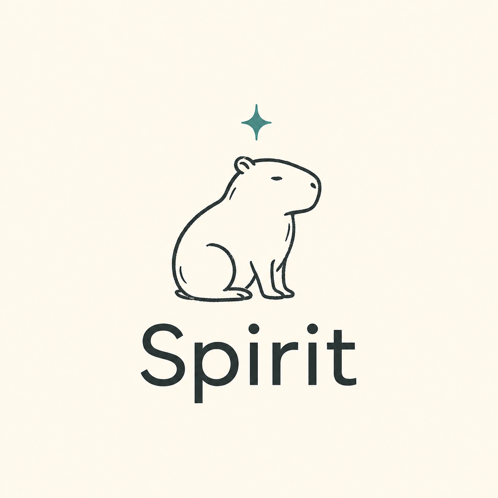
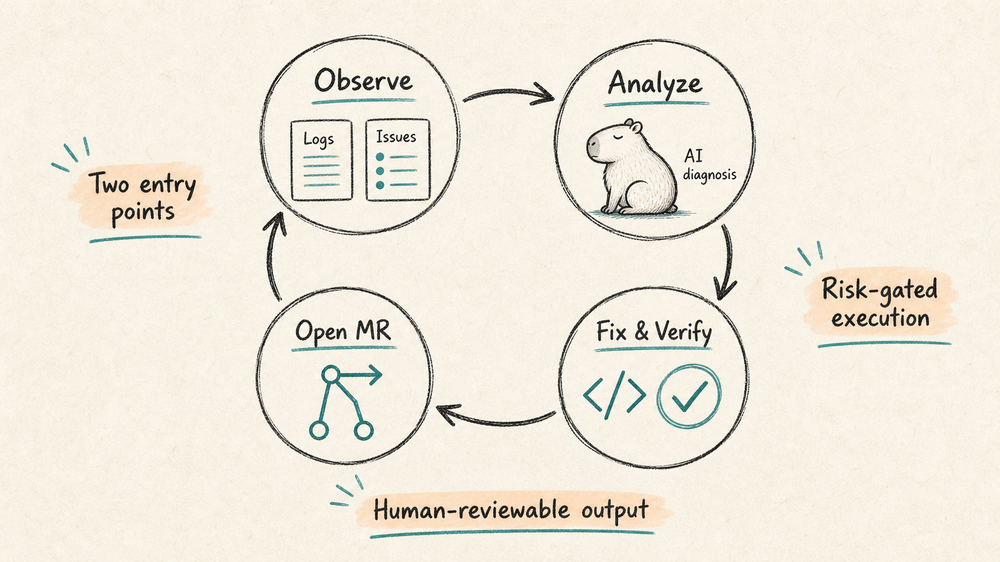

# Spirit

[English](#english) · [简体中文](#简体中文)





<a id="english"></a>

## English

Spirit is an AI workflow that closes the loop from observation and analysis to code changes and merge requests.

For the design rationale and prompts, see [arczhi/spirit](https://github.com/arczhi/spirit).

It has three main paths:

- **Log-driven:** watches Elasticsearch and local logs, groups errors, diagnoses root causes, and safely auto-fixes low-risk incidents through GitLab merge requests.
- **Issue-driven:** polls GitLab Issues with selected labels, develops in isolated worktrees, and creates merge requests.
- **Self-monitoring:** analyzes and attempts to repair the Spirit watcher when it becomes blocked or fails.

The goal is not to add a Copilot to an existing process. It is to build an observable, executable, verifiable, and auditable automation loop.

### What is implemented

- **MCP Server:** exposes 18 stdio tools for logs, code, databases, incidents, Git, and CI.
- **Watcher:** polls Elasticsearch and tails file logs; combines fingerprint and semantic deduplication to reduce repeated alerts.
- **Analyzer:** uses Claude for structured diagnoses, risk levels, and fix plans.
- **Auto Fix:** changes code in a Git worktree, validates locally, commits, pushes, and creates a merge request per incident.
- **MR comment repair:** continues fixing the same branch when new human review comments arrive.
- **Issue workflow:** polls labeled Issues, creates isolated worktrees, persists agent conversations, and supports comment-driven iterations.
- **State storage:** SQLite stores incidents, issue tasks, and comment watermarks.

### Quick start

Install dependencies:

```bash
npm install
```

Copy the configuration:

```bash
cp config.example.yaml config.local.yaml
```

At a minimum, configure:

- `environments[].elasticsearch`
- `environments[].codeRoots`
- `gitlab.url` / `gitlab.token`
- `claude.apiKey` / `claude.baseUrl` / `claude.model`
- `storage.path`

### Run

Start the MCP server:

```bash
npm run mcp
```

Connect it from Claude Code or an IDE:

```json
{
  "mcpServers": {
    "spirit": {
      "command": "npx",
      "args": ["tsx", "/path/to/spirit/src/mcp/index.ts"]
    }
  }
}
```

Start the main watcher:

```bash
npm run watcher
```

Start self-monitoring:

```bash
npm run self-monitor
```

Run checks:

```bash
npm run typecheck
npm test
```

### Workflows

**Log alert flow**

```text
ES / File Log
  -> fingerprint / semantic dedupe
  -> Claude analysis
  -> risk gate
  -> worktree fix
  -> local verification
  -> GitLab MR
```

**Issue development flow**

```text
GitLab Issue (label)
  -> task record in SQLite
  -> dedicated worktree + feature branch
  -> Claude tool-use loop
  -> commit / push / MR
  -> issue comments resume the same task
```

### Configuration highlights

- `environments[]` binds log sources, databases, and code repositories to one environment model.
- `watcher.riskAutoFix` defines which risk levels may proceed to automatic fixes.
- `watcher.issueWatcher.*` controls issue polling, comment polling, maximum iterations, and environment priority.
- `gitlab.defaultTargetBranch` sets the default target branch for auto-fix and issue merge requests.

See `config.example.yaml` for all fields.

<details>
<summary><strong>简体中文</strong></summary>

<a id="简体中文"></a>

## 中文

Spirit 是一个把观测、分析、改码、提 MR 串成闭环的 AI 工作流。

设计思路和提示词，请参考仓库：[arczhi/spirit](https://github.com/arczhi/spirit)。

它现在有三条主线：

- **日志驱动：**监听 Elasticsearch 和本地日志，聚合错误、分析根因，并对低风险问题自动修复后提交 GitLab MR。
- **Issue 驱动：**轮询带指定标签的 GitLab Issue，在独立 worktree 中开发并创建 MR。
- **自监控：**Spirit 自己的 watcher 发生阻塞或错误时，会尝试分析并修复。

设计思路不是“给现有流程加个 Copilot”，而是把系统拆成可观测、可执行、可验证、可审计的自动化链路。

### 当前实现

- **MCP Server：**通过 stdio 暴露 18 个工具，覆盖日志、代码、数据库、incident、Git 和 CI。
- **Watcher：**同时轮询 ES 和监听文件日志，结合 fingerprint 与语义去重，减少重复告警。
- **Analyzer：**调用 Claude 输出结构化诊断、风险等级和 fix plan。
- **Auto Fix：**在 Git worktree 中改代码、本地校验、提交、推送，并为每个 incident 创建 MR。
- **MR 评论回修：**发现新的人工评论后，继续在同一分支修复。
- **Issue 工作流：**轮询带标签的 Issue，创建独立 worktree，持久化 agent 对话，并支持评论驱动的多轮迭代。
- **状态存储：**使用 SQLite 保存 incidents、issue_tasks 和评论水位线。

### 快速开始

安装依赖：

```bash
npm install
```

复制配置：

```bash
cp config.example.yaml config.local.yaml
```

至少需要补齐以下配置：

- `environments[].elasticsearch`
- `environments[].codeRoots`
- `gitlab.url` / `gitlab.token`
- `claude.apiKey` / `claude.baseUrl` / `claude.model`
- `storage.path`

### 运行方式

启动 MCP Server：

```bash
npm run mcp
```

在 Claude Code 或 IDE 中按如下方式接入：

```json
{
  "mcpServers": {
    "spirit": {
      "command": "npx",
      "args": ["tsx", "/path/to/spirit/src/mcp/index.ts"]
    }
  }
}
```

启动主 watcher：

```bash
npm run watcher
```

启动自监控模式：

```bash
npm run self-monitor
```

常用检查命令：

```bash
npm run typecheck
npm test
```

### 工作流

**日志告警流**

```text
ES / File Log
  -> fingerprint / semantic dedupe
  -> Claude analysis
  -> risk gate
  -> worktree fix
  -> local verification
  -> GitLab MR
```

**Issue 开发流**

```text
GitLab Issue (label)
  -> task record in SQLite
  -> dedicated worktree + feature branch
  -> Claude tool-use loop
  -> commit / push / MR
  -> issue comments resume the same task
```

### 配置重点

- `environments[]` 将日志源、数据库和代码仓库绑定到同一个环境模型。
- `watcher.riskAutoFix` 控制哪些风险等级允许进入自动修复。
- `watcher.issueWatcher.*` 控制 Issue 轮询、评论轮询、最大迭代次数和环境优先级。
- `gitlab.defaultTargetBranch` 决定 auto-fix 和 Issue MR 的默认目标分支。

完整字段见 `config.example.yaml`。

</details>
